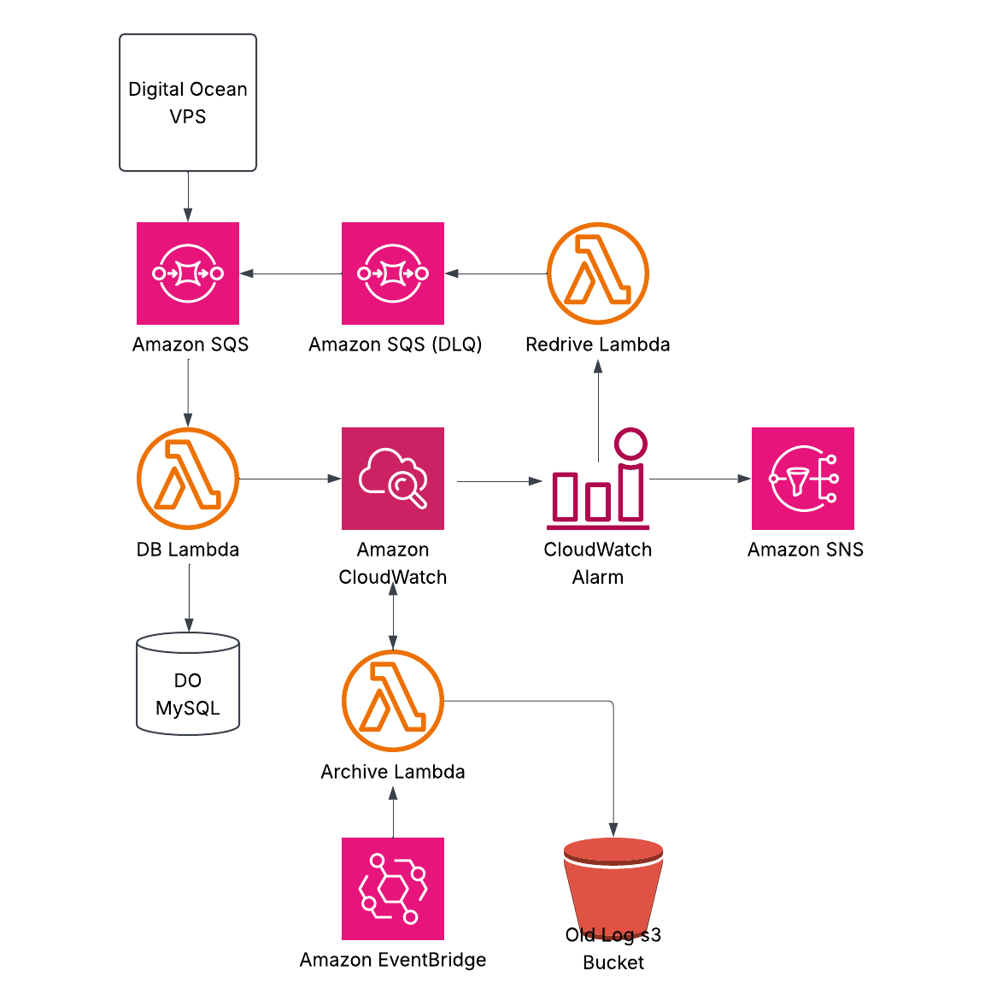

# 🖌️ Drawing Board: a Terraform and AWS learning project

A small full-stack drawing application built to learn how Terraform, AWS, containers, and CI/CD fit together in a production-style deployment. Drawing requests travel from an Express application on a DigitalOcean VPS to Amazon SQS, then to an AWS Lambda worker that stores them in a managed MySQL database.

## 🗺️ Overview



The application runs two Express containers behind nginx on a DigitalOcean VPS. The API queues drawing-coordinate work in Amazon SQS; Lambda consumes that work and writes it to DigitalOcean MySQL. Terraform provisions the AWS queue, Lambda function, and least-privilege IAM identity used by the application. The diagram also shows the intended reliability path for dead-letter handling, archiving, alarms, and notifications.

## 🎯 Goals of this project

- Learn how to provision, update, and safely track cloud infrastructure with Terraform.
- Build a queue-backed serverless workflow instead of handling all database work directly in the web application.
- Practice infrastructure state, modules, IAM permissions, and repeatable deployments.
- Deploy application and infrastructure changes through GitHub Actions.

## 🧰 Key skills used

### Terraform

- Variables, sensitive inputs, outputs, and remote S3 state
- Provider and version constraints
- Reusable SQS and Lambda modules
- IAM, Lambda, SQS, and resource dependency management
- Planning, applying, and safely refactoring state addresses

### AWS and infrastructure

- Amazon SQS with a dead-letter queue
- AWS Lambda and event-source mappings
- IAM users and least-privilege SQS permissions
- S3-backed Terraform state with lockfiles
- GitHub Actions OIDC authentication for AWS
- Docker Compose, nginx, and DigitalOcean VPS deployment
- DigitalOcean managed MySQL with a CA certificate

## 💭 Reflection / what I learned

### ☁️ Managing infrastructure as code

Before this project, most cloud configuration I used was created through provider consoles. Terraform made the infrastructure reproducible: resources, relationships, and configuration now live alongside the application code. It also made the impact of a change visible before applying it, which is especially helpful when working with paid cloud services.

### ⚡ Designing around queues and serverless work

The queue and Lambda worker separate the web request from database work. That boundary makes it easier to reason about failures and gives the system a natural place to add retries, dead-letter handling, monitoring, and archival work as the project grows.

### 🔐 Treating IAM as application design

IAM was one of the more challenging parts of the project. Terraform helped make the intended permissions explicit: the application runtime identity can send messages only to this project's queue. Working through that policy reinforced that security is not an afterthought—it is part of how the system is designed.

### ✨ Final thoughts

AI assisted the project, but understanding it still required reading documentation, experimenting with Terraform commands, and tracing how deployment, state, queues, and credentials connect. This project is part of my continuing work to grow beyond feature development into infrastructure and operational ownership.

## 🚀 Possible next steps

- Provision the diagram's archive Lambda, EventBridge schedule, S3 log archive, CloudWatch alarms, and SNS notifications with Terraform.
- Add a redrive workflow for messages that reach the dead-letter queue.
- Add automated tests and a deployment approval step before production applies.
- Add rolling or blue-green deployment support for the VPS application containers.
- Move database credentials to a dedicated secrets-management workflow.

## 🛠️ Do it yourself

### ✅ Prerequisites

- Terraform 1.6 or newer
- AWS CLI credentials with permission to use the configured AWS account and state bucket
- Node.js 22 or newer
- A DigitalOcean MySQL database and its CA certificate
- A DigitalOcean VPS if you want to deploy the web application

Clone the repository and enter the project directory.

```bash
git clone <repository-url>
cd drawing-board
```

Create a local Terraform variables file. It is ignored by Git because it contains database credentials.

```bash
cd terraform
cp /dev/null prod.tfvars
```

Add your own values to `prod.tfvars`:

```hcl
aws_region = "us-west-2"
username   = "your_database_username"
password   = "your_database_password"
host       = "your_database_host"
port       = "your_port_here"
database   = "your_database_name"
sslmode    = "REQUIRED"
```

Install the Lambda dependencies and place the database CA certificate at `lambda/ca-certificate.crt` before packaging.

```bash
cd ../lambda
npm install
npm run zip
cd ../terraform
```

Initialize Terraform. This project uses an S3 backend with one fixed state key.

```bash
terraform init -reconfigure -backend-config=terraform-backend.hcl
```

Format, validate, and review the proposed infrastructure changes.

```bash
terraform fmt -check -recursive
terraform validate
terraform plan -var-file=prod.tfvars
```

Provision the AWS resources.

```bash
terraform apply -var-file=prod.tfvars
```

The production deployment workflow creates `prod.tfvars` from GitHub Actions secrets, provisions Terraform, uploads the app to the VPS, and rebuilds the Docker Compose services. Configure the corresponding repository secrets before using it.

> **Warning:** This backend points at the project's persistent remote state. Do not run `terraform destroy` against a live deployment. Use a separate state key and credentials for an isolated test stack.
